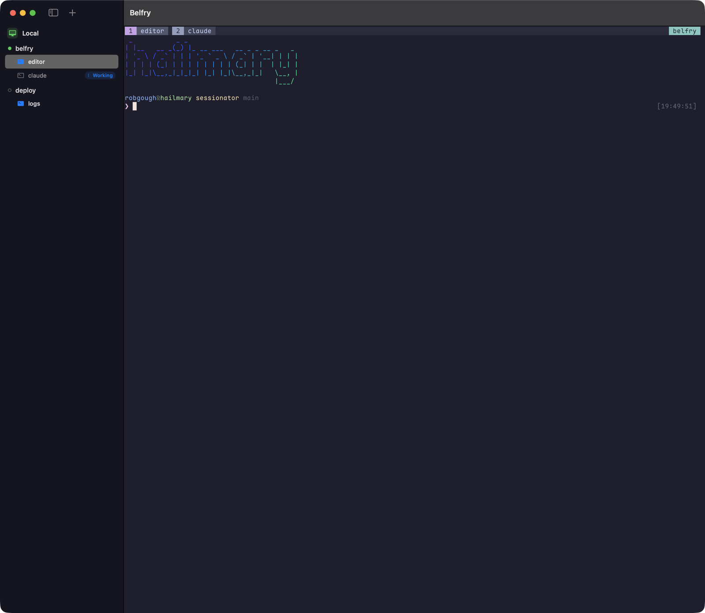

# Belfry

A native macOS + iPadOS front-end for **real tmux**: a sidebar of hosts → sessions → windows you click to switch, with the selected session's live terminal filling the rest. Works against your local tmux server and remote machines over SSH — and shows live **Claude Code status badges** so you can see at a glance which session is working and which one is waiting on you.

Your sessions live in tmux, exactly as they always have. Belfry attaches; it never owns them. Quit the app, kill the network, switch devices — everything keeps running.



## Features

- **Host → session → window tree**, driven by tmux control mode (`tmux -C`). On tmux ≥ 3.2 updates arrive by server push (`refresh-client -B` format subscriptions) — near-zero idle traffic and wakeups; older servers fall back to a light poll.
- **Instant switching.** Every visited session keeps a warm, attached surface; changing sessions is a visibility toggle, not a re-attach.
- **Claude Code badges.** Per-window *Working / Waiting / Agents* states, powered by optional [status hooks](docs/claude-status-hooks.md) you can install per-host from the UI (they stamp a `@claude_state` tmux window option; removal is one click and only touches Belfry's tagged entries). On macOS the Dock badge counts windows waiting for your input.
- **Send files to Claude Code** (macOS). Drag an image — or any file — onto the terminal, or use the paperclip toolbar button: the file's path is pasted into the prompt, and on SSH hosts the file is first uploaded over the existing connection so the remote Claude Code can read it.
- **Battery-conscious by design.** Hidden surfaces absorb output without rendering, animations run in the render server, and the idle app measures ~0% CPU.
- **macOS**: terminals render with libghostty (via a vendored [Termini](https://github.com/arach/Termini)); your Ghostty colour theme is picked up automatically (Catppuccin Mocha fallback). The local tmux server is started under launchd, so even force-quitting Belfry can't take your sessions down.
- **iPadOS/iOS**: terminals render with [SwiftTerm](https://github.com/migueldeicaza/SwiftTerm) over SwiftNIO SSH (no processes to spawn on iOS). Touch scrollback (swipe = tmux copy-mode wheel), a key bar with esc/ctrl/arrows, bundled Maple Mono NF for nerd-font glyphs, credentials in the Keychain, and a background grace period so quick app switches keep connections alive — longer absences reconnect and resync instantly on return.

## Installing

Install with [Homebrew](https://brew.sh):

```sh
brew tap robgough/belfry
brew install --cask belfry
```

(If you run Homebrew with `HOMEBREW_REQUIRE_TAP_TRUST` set, run
`brew trust robgough/belfry` after tapping — it refuses untrusted third-party
taps until then.)

Prefer a direct download? A notarized, universal `Belfry.app` (macOS 14+) is on
the [releases page](https://github.com/robgough/belfry/releases/latest) — unzip
and drag to Applications. Either way the app keeps itself current via Sparkle;
changes per release are in [CHANGELOG.md](CHANGELOG.md).

## Building

### macOS (14+)

Requires tmux (`brew install tmux`) and Xcode's toolchain.

```sh
swift build                     # debug binary
scripts/make_app.sh release     # assembles + ad-hoc signs Belfry.app
open Belfry.app
```

### iPadOS / iOS (17+)

Requires [xcodegen](https://github.com/yonaskolb/XcodeGen) (`brew install xcodegen`).

```sh
xcodegen generate               # produces BelfryiOS.xcodeproj (gitignored)
open BelfryiOS.xcodeproj        # set your team under Signing, then run
```

Add hosts in-app: hostname, user, port, and either a password or an unencrypted ed25519 private key (paste the PEM; generate a dedicated one with `ssh-keygen -t ed25519`). Secrets are stored in the Keychain, never in the hosts file. The remote end needs `sshd` and `tmux` — and if you want your dev machines reachable from anywhere, [Tailscale](https://tailscale.com) pairs beautifully with this.

Cutting a release — the notarized macOS zip (with the Sparkle appcast) or an
iOS TestFlight build: see [RELEASING.md](RELEASING.md).

## Architecture, briefly

Each host gets two planes. The **control plane** is a `tmux -C` client attached to a hidden per-launch session — it feeds the sidebar and issues actions, and never sizes your real sessions. The **data plane** is one terminal surface per visited session running `tmux attach`. Both ride a per-platform transport behind a small seam: macOS forks PTYs (and drives the system `ssh` with connection sharing and a native askpass dialog); iOS speaks SSH in-process via SwiftNIO, running tmux as exec channels.

`vendor/Termini` is vendored (MIT) with local patches documented in [LOCAL_PATCHES.md](vendor/Termini/LOCAL_PATCHES.md) — most are on their way upstream.

## License

MIT © Rob Gough — see [LICENSE](LICENSE).

Bundled third parties: [Termini](https://github.com/arach/Termini) (MIT), [Ghostty](https://github.com/ghostty-org/ghostty)/GhosttyKit (MIT), [SwiftTerm](https://github.com/migueldeicaza/SwiftTerm) (MIT), and [Maple Mono](https://github.com/subframe7536/maple-font) NF (SIL OFL 1.1).
